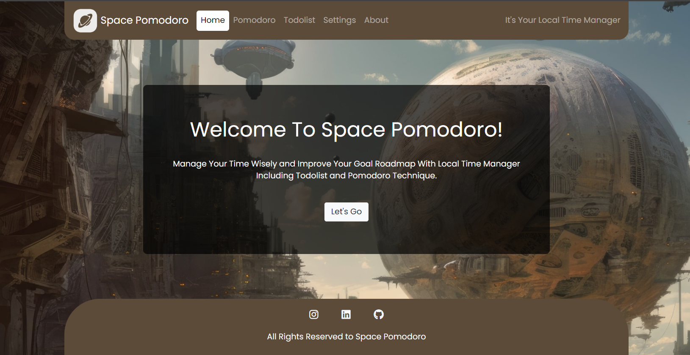

# Space Pomodoro Website
#### (Project In Progress)




## Developer Todo 📝
- [x] [Settings Panel > Theme]()
- [x] [Settings Panel > Other]()
- [x] [Add Task Manager]()
- [x] [Fix bg freeze]()
- [ ] [Add userlogin]()
- [ ] [Connect framework]()
- [ ] [Cleanup css]
- [ ] [Cleanup js]

## How to Run ▶

1- Clone project via command below

```
user> cd Desktop/main.py
```

➡ terminate callbacks if caused possible conflicts in test


## Features ⚙
* Recieving Updated Mtproto Proxy
* Recieving Updated Configs
* Joining The Channel Via Link

<br/>

## Countribute 🤝
Feel free to contribute

## Communication 💌
* [Website](https://www.pariya-tavangar.ir)
* [Github](https://github.com/Ptavangar)
